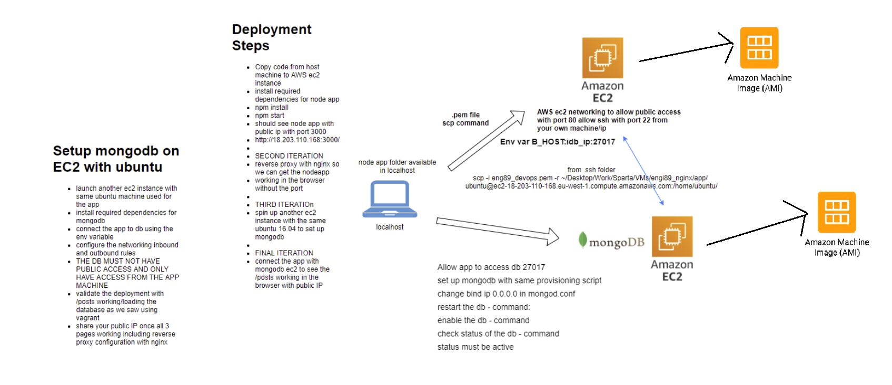

# Two-tier architecture
## Tasks


## App instance

### Launch instance

Click on **'Launch instances'** on 'Instances' page<br>
Select **'Ubuntu Server 16.04 LTS (HVM), SSD Volume Type'** machine<br>
Keep instance type as it is (t2.micro)<br>
### Configure instance details:
- Change subnet to **'default 1a'**<br>
- Enable auto-assign public IP<br>
- Add storage: keep as it is<br>
### Add tags:
- Add a tag<br>
- Set key to 'Name'<br>
- Set value to 'SRE_\<name\>_app
### Configure security group
- Change SSH rule's Source to 'My IP'<br>
- Add a rule for HTTP to have it accessible from anywhere

## Launch
- Choose **'sre_key'** and click **Launch**

- Make the key read-only:<br>
`chmod 400 sre_key.pem`

- Connect to the instance via ssh:<br>
`ssh -i "sre_key.pem" ubuntu@ec2-52-213-227-200.eu-west-1.compute.amazonaws.com`<br>

### Set the app machine up:
In '**provision_app_1.sh**' file:
```
!#/bin/bash
sudo apt-get update -y
sudo apt-get upgrade -y
sudo apt-get install nginx -y
sudo apt-get install python-software-properties -y
curl -sL https://deb.nodesource.com/setup_6.x | sudo -E bash -
sudo apt-get install nodejs -y
```
Make it executable:
`sudo chmod +x provision_app_1.sh`<br>
Run it: `./provision_app_1.sh`

Copy the app to the cloud (from own machine):<br>
`scp -i ~/.ssh/sre_key.pem -r /app ubuntu@<IP>:/home/ubuntu/`

Copy nginx config file from own machine:<br>
`scp -i ~/.ssh/sre_key.pem default ubuntu@<IP>:/home/ubuntu/`<br>
In '**provision_app_2.sh**' file:

```
!#/bin/bash
cd /home/ubuntu/app
sudo npm install pm2 -g -y
sudo npm install
sudo rm /etc/nginx/sites-available/default
sudo cp /home/ubuntu/default /etc/nginx/sites-available/default 
sudo nginx -t
sudo systemctl restart nginx
echo "DB_HOST=54.217.14.120:27017/posts" | sudo tee -a /etc/environment
source /etc/environment
```

Finish setting up by running '**provision_app_2.sh**'

## DB instance

In '**provision_db.sh**' file:
```
!#/bin/bash
sudo apt-get update -y
sudo apt-get upgrade -y
wget -qO - https://www.mongodb.org/static/pgp/server-4.4.asc | sudo apt-key add -
echo "deb [ arch=amd64,arm64 ] https://repo.mongodb.org/apt/ubuntu xenial/mongodb-org/4.4 multiverse" | sudo tee /etc/apt/sources.list.d/mongodb-org-4.4.list
sudo apt-get update -y
sudo apt-get install -y mongodb-org
sudo systemctl start mongod
sudo systemctl enable mongod
```
Change IP in '**/etc/mongod.conf**' to 0.0.0.0<br>
Restart **mongod**:<br>
`sudo systemctl restart mongod`

## Add rules on AWS

### On App's security group **Edit inbound rules**:


### On DB's security group **Edit inbound rules**:


## On App machine:
Load the data: `node seeds/seed.js`<br>
Start the app: `npm start`
